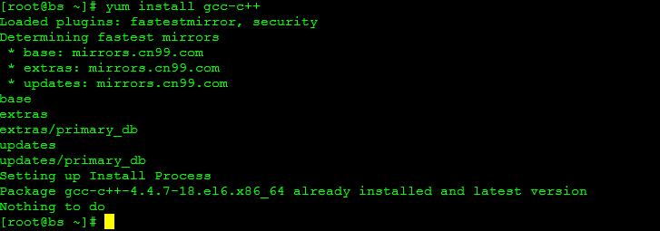
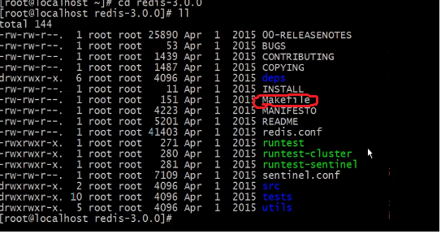
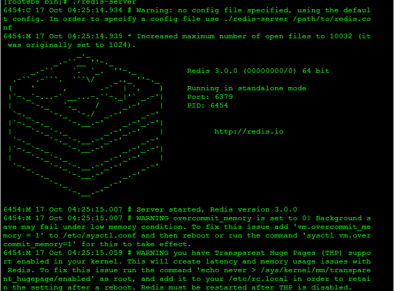
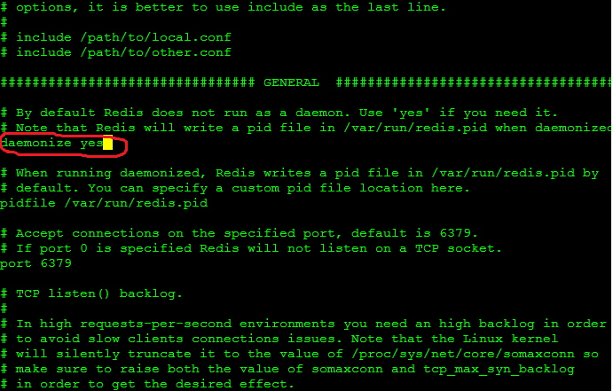
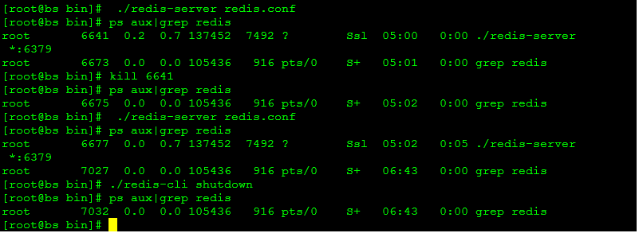

---
layout: post
title: "redis安装"
date: 2017-10-17
tags: 博客
---

##redis是现在主流的缓存服务器，在现如今高并发时代，redis集群也变得尤为重要，我也初步了解认识下redis.redis是一个key-value存储系统。和Memcached类似，它支持存储的value类型相对更多，包括string(字符串)、list(链表)、set(集合)、zset(sorted set --有序集合)和hash（哈希类型）....下面我来简单说下安装步骤（注：本文主要介绍在linux系统下的安装步骤）
redis官网地址：http://www.redis.io/(官网也有文档说明)
准备：Redis是c语言开发的。
安装redis需要c语言的编译环境。如果没有gcc需要在线安装。
yum install gcc-c++ 如图（我的已经安装好了）

安装步骤
1.redis的源码包上传到linux系统。
2.解压缩:tar zxvf redis-3.0.0.tar
3.编译：进入解压后的文件，你会看到一个makefile的编译文件，直接输入命令：make 编译即可。

4.安装：make install PREFIX= /usr/local/redis(你安装的目录)
5.启动：进入你安装目录下的bin会看到一个redis-server的文件

输入命令：./redis-server即可启动，如下图，这是前端启动模式。

6.后端启动：我们需要方便，所以需要后端启动，这时我们需要配置一下，我们将之前解压的redis文件夹中，复制一份redis.conf到usr/local/redis;命令：cp redis.conf /usr/local/redis/bin；然后vim编辑:vim redis.conf,修改daemonize yes,在运行即可，后台启动。

7.查看：ps aux|grep redis 如下图，说明启动成功啦。
8.关闭：第一种可以 kill 
也可以：./redis-cli shutdown

这样redis就按好了。
